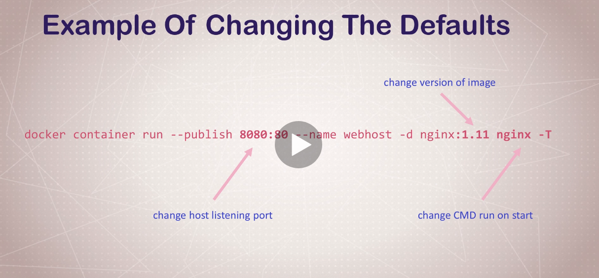

# Docker Commands
Docker community keeps on updating and adding new features to the docker, So download the
latest docker application first before going to use it. Always use docker with the sudo 
privileges. 


# Common Commands for Docker

## Command 1 (Run docker Images in running state) 

Run docker with command


```
sudo docker container run --publish 80:80 --detach nginx
```

in which we used

* **--publish 80:80**

        docker server is running on port 80 and  docker server communicates with our local server/pc on port 80
* **--detach**

        Detach flag will run the docker image in the background
* **nginx**

        Name of the image which we are going to run.



## Command 2 (See docker Images)

if you want to see the docker images which are currently in running state than use 

```
docker container ls
```

## Command 3 (See all docker images )

use this command if you want to see all the images in running or stoped state.

```
docker container ls -a
```

## command 4 (Run docker image with a name)

Its good to start a docker image with a name istead if finding your image
later by its id.So to run docker image with an image use this command

```
docker container run --publish 80:80 --detach --name nginx_webhost nginx
```

## command 5 (See docker image logs)

If you want to see docker container logs than you can use this command

```
docker container logs webhost
```
in this command webhost represents the name of the image


## Command 6 (See process running inside the docker container)

if you want to see the process running inside the docker image than use this command

```
docker conatiner top webhost
```
in this command webhost represents the name of the image


## Command 7 (Remove docker Image)
Use this command to remove docker image

```
docker container rm -f image_id
```

* **-f** : To forcefully remove the image


## Command 8 (See the docker processes)
Use this command to see the docker processes

```
docker ps
```

## Command 9 (pass environemnt variable to the docker container)
If you want to set an environment variable inside a docker image use this **--env or -e** flag

```
docker conatainer run -e MYNAME=SOHAIB image 
```

## Command 10 (See available imaes information)
If you want to see the available images information use this command

```
docker image ls
```
## Command 11 (stats of running containers)
If you want to see the stats of the running container. e.g ram utilization, I/O operations, Network operations etc than use this command

```
docker container stats
```

## Command 12 (Get inside the container)
If you want to get inside the container than use this command

```
docker container run -it --name server nginx bash
```

* **-i**     : for Interavtive docker container
* **-t**     : for runtime tty instead of the ssh
* **nginx**  : Name of the image which we are going to run
* **bash**   : Name of the shell which we want to use inside the docker container (sh, bash etc)


## Command 13 (Start and existing container)
If you want to start an existing container than use this command

```
docker container start -ai
```

* **-a** : For attaching container for getting outputs and errors
* **-i** : For getting an interactive session.

Their is a difference in running and starting the container. 

Running a container means that your image will first loaded into the container and than container is executed

Starting a container means that your image is already loaded into the container you just need to start the container now.

## Command 13 (Get into the shell of already running container)

If you want to get into the shell of already running container than you can use this command

```
docker container exec -it mysql bash
```
* **-i**    : For interactive session
* **-t**    : Create runtime tty
* **mysql** : This is the name of the container
* **bash**  : Program you want to run inside the container


## Command 14 (Pull Image without starting)
if you want to pull an image without running a container than use this command

```
docker pull ubuntu
```
* **alpine** : alpine is the name of the image which I am going to pull

## Command 15 (History of the image)
If you want to see what new things added or deleted from the image you can all the history with this command.

```
docker container history nginx:latest
```

where nginx is the name of the image and latest tag is the version of the image.


# Author 

* Sohaib Anwaar
* gmail          : sohaibanwaar36@gmail.com
* linkedin       : [Have Some Professional Talk here](https://www.linkedin.com/in/sohaib-anwaar-4b7ba1187/)
* Stack Overflow : [Get my help Here](https://stackoverflow.com/users/7959545/sohaib-anwaar)
* Kaggle         : [View my master-pieces here](https://www.kaggle.com/sohaibanwaar1203)

# Helping Material

* Udemy -> Docker Mastery with kubernetes + swarm from a Docker Captain